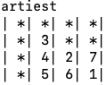

# Beat your Friends at Anagrams and Wordhunt
Tired of Losing to your Friends in GamePigeon word-based games? Try this.

# Anagrams
Run
```
python3 anagrams.py
```

and input each of the 6 letters generated by the game on a newline. Press enter and the program will output a list of words sorted by longest to shortest length.

# Wordhunt
Run
```
python3 wordhunt.py
```
and input each of the 16 letters on a newline in row-major order (start at top-left, end at bottom-right). Press enter and the program will output a sequence of boards that highlight words (it may take some seconds). The output is sorted so that the longest words appear at the bottom.

To read the output, consider for example:



The word starts at the position denoted by 1 and the subsequent letters are denoted by 2, 3, etc. The word itself is listed on top. 

Note: I don't condone cheating. 

